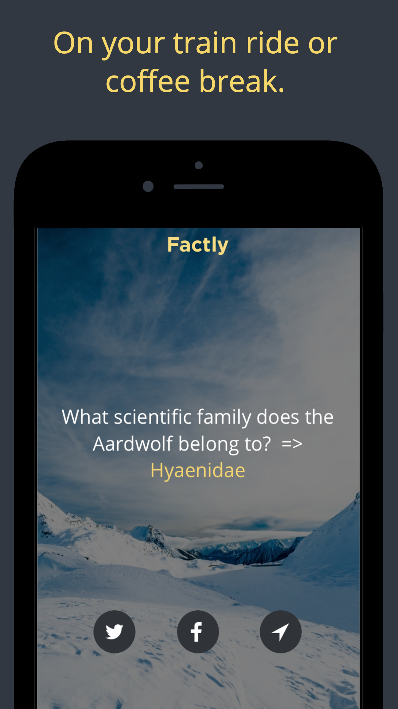
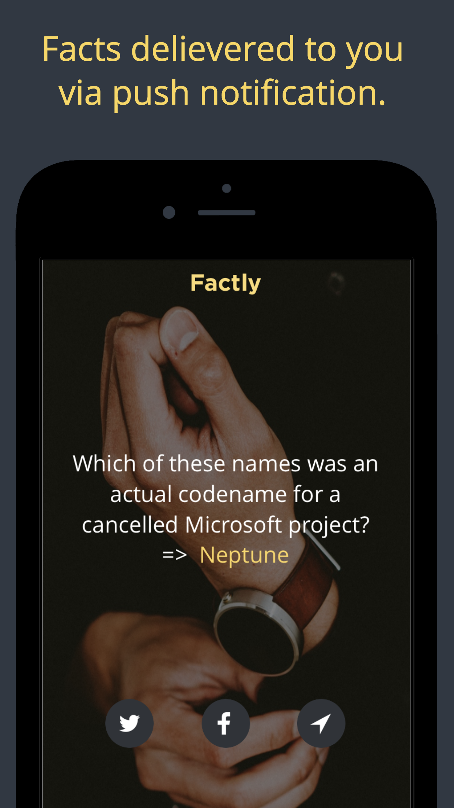

# Factly Open Source iOS App (Learn New Facts Every Day)

App Store Link: http://apple.co/2mdeltk

Learn something new on your commute, coffee break or simply because it's fun!

# About

- Get a new fact delivered to your device each and every day of the year. 
- No need to worry if you forget to check because you will receive a local notification when your new quote has arrived!

Expand your knowledge horizons with Factly. This app contains hundreds of facts that you or your best friend most likely didn’t know before. Factly has one of the largest and most tailored archives of fun and interesting facts for you to enjoy and share with friends and family. You will be able to entertain yourself or others for any period of time. 

Want everyone to think you’re super smart? What better way to learn new facts. Amaze others with your unique knowledge of facts and stand out from the crowd. Or just try to learn something new every day. You will have loads of fun with Factly so try it out today for free!

# Features

- Get an interesting fact every day.
- Share your fact on your favorite social networks.
- Tons of fact topics! Always be surprised!
- Beautiful design.
- Become smarter as you improve your mind & memory.
- Free, and with no ads!

# Tags
cool facts,daily facts,did you know,facts app,fun,hacks,history,interesting,learn,life,quote,trivia