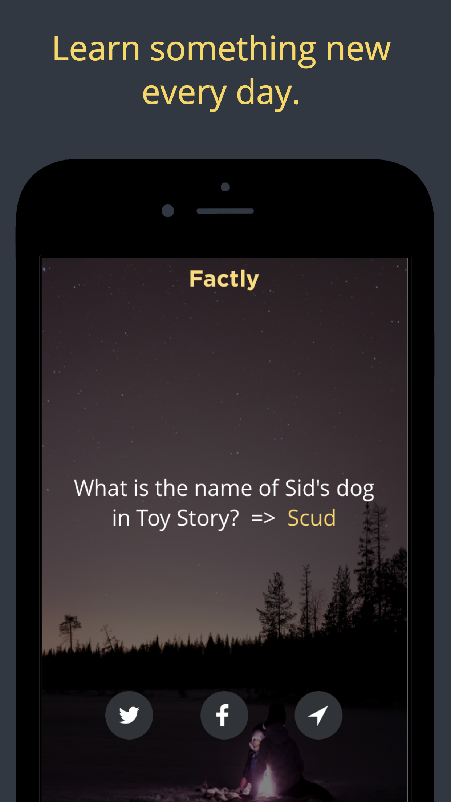

# Factly Open Source iOS App (Learn New Facts Every Day)

App Store Link: http://apple.co/2mdeltk
Learn something new on your train ride, coffee break or when you visit the loo!

# Core Concept
1. Get a new fact delivered to your device each and every day of the year. 
2. No need to worry if you forget to check because you will receive a local notification when your new quote has arrived!

# Broad Features
* Useful fact every day
* Shareable on social networks
* Tons of fact topics! Always be surprised!
* Beautiful design
* Become smarter as you improve your mind & memory
* Free, and with no ads!

# Core Features
* Local notifications

# Tags
fact, quote, academic, life, goals, mind, learn, remember, facts, school, quiz, quizup, brain, peak, memory, more